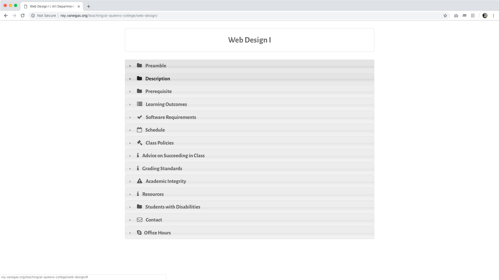
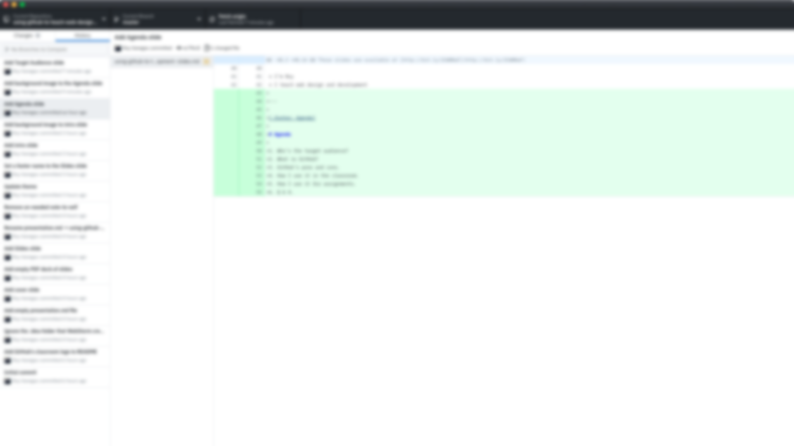

slidenumbers: true
autoscale: true
build-lists: true
theme: work, 1
footer: Using GitHub to Teach Web Design/Development

[.hide-footer]

# Using GitHub to Teach Web Design/Development

Roy Vanegas
Art Department
Queens College

## Teaching & Learning Showcase
## 2 November 2018

^
* Be already logged in to GitHub’s web site
* Check projector resolution
* 1080p, 1080i, and 720p: 16:9
* Aspect ratio is set under Presentation menu
* Fill water bottle

---

[.footer: Slides]

# Slides

These slides are available at [http://bit.ly/2CWNNaF](http://bit.ly/2CWNNaF)

---

[.footer: Introduction]

# Hi!
* I’m Roy
* I teach web design and development

---

[.footer: Agenda]

# Agenda
1. Who is the target audience?
2. What is GitHub?
3. GitHub’s pros and cons.
4. How I use it in the classroom.
5. Q & A.

---

[.footer: Target Audience? (1 of 5)]

# Who’s The Target Audience?
* Design educators using tools such as Photoshop, Illustrator, InVision, Sketch, etc.
* Computer scientists teaching engineering concepts using computer programs.
* *Any* educator sharing computer files with their students.

---

[.footer: What is GitHub? (2 of 5)]

# What is GitHub?
* It allows users to keep track of changes made to a project — whether it’s a programming project, a design project, or both.
* It promotes the concept of divide-and-conquer through “branching,” a technique that allows learners to work on sections of a project independently.
* It encourages sharing in an open source manner, which is especially helpful in the classroom.
* It is much more than I can explain in 20 minutes.

---

[.footer: What is GitHub? (2 of 5)]

# What is GitHub?
* GitHub is comprised of a web site *and* a local application.
    1. Web site: [https://github.com](https://github.com)
    2. Desktop application: [https://desktop.github.com/](https://desktop.github.com/)
* Public projects are *free*; private projects require a fee.
* Students and educators are eligible for *free* private projects at [https://education.github.com/](https://education.github.com/).

---

[.footer: GitHub’s Pros and Cons? (3 of 5)]

# GitHub’s Pros and Cons?

## (Some) Cons (for the Learner)
* Steep learning curve.
* Requires a new learning paradigm.
* Learning is more proactive.

^
* Careful attention is required, especially at the outset.
* Note-taking is different, because I write the notes for you.
* Adding GitHub to a learner’s workflow means there is more software to manage.

---

[.footer: GitHub’s Pros and Cons? (3 of 5)]

# GitHub’s Pros and Cons?

## (Some) Cons (for the Educator)
* Onboarding is difficult, as students stray early on.
* Core concepts must be repeated…for weeks.
* Focused attention required for in-class examples.

---

[.footer: GitHub’s Pros and Cons? (3 of 5)]

# GitHub’s Pros and Cons?

## (Some) Pros (for the Learner)
* Nearly impossible to lose work.
* Design ideas are shared through assignment submissions.
* No need to take detailed notes.

^
* Just about everything can be retrieved with GitHub.
* Every learner can see how their peers created their work, and learn from it.
* In-class work is documented in a live coding situation, step-by-step.

---

[.footer: GitHub’s Pros and Cons? (3 of 5)]

# GitHub’s Pros and Cons?

## (Some) Pros (for the Educator)
* Easy to disperse lectures to learners.
* Easy to distinguish lectures between classes.
* Easy to switch between learners on crit days.
* Easy to uncover plagiarism between learners.

^
* Slack a link to all my students in real time.
* Using tags, I can easily assign a repo to a course.
* Having everyone submit the same file in different branches makes it easy to distinguish one learner’s work from another.
* Git diffs make it easy to identify how similar two or more repos are, and which one came first.

---

[.footer: How I use GitHub in the Classroom (4 of 5)]

# How I use GitHub in the Classroom

---

[.footer: Q & A (5 of 5)]

# [fit] Q & A

---

[.hide-footer]

# [fit] Links

__Slides__ [http://bit.ly/2CWNNaF](http://bit.ly/2CWNNaF)    
__GitHub__ [https://github.com/code-warrior/](http://bit.ly/2CWNNaF)  

---

[.hide-footer]
[.build-lists: false]

# [fit] Image Credits

* __Slide 4__: Flickr user [niftynotebook](https://www.flickr.com/photos/33237593@N06/6508476351/in/photolist-aV8Dgv-dKG6BS-4LJRab-bnad4V-koTkh6-bUvSUG-uyQvQ-gqt9vf-P3aGcq-aF1x5-b2aQDa-6cbUb2-7giHHi-ar1TbU-4vTfNx-6tra2K-6jd56X-55RVJ-ar1Tc7-7jjGyz-2baQhek-o5yTXU-7aKGH8-uJQat-5KAPnQ-ai7LJd-2azpvf4-9YRGcq-dw1xqi-29CjDm7-9z2JU-5KAMZ9-58xtd-26VZuhF-WnNhdh-58xqY-kL5V69-2aHNPHc-5KAMTo-SH89YT-2b7kWTm-REwjeP-5Kwy2a-WnMaby-CjLocr-VR6JAd-q95fz8-6keSjR-nhM25x-R5HCA1)  
* __Slide 5__: Flickr user [marc thiele](https://www.flickr.com/photos/marcthiele/15257471045/in/photolist-pffwzB-8sjDDr-7zynaA-8AHtFV-qRo4AH-8nhxr8-nxnGPo-aoH2bs-gZujGW-84gpEL-7DaQsL-28EKo4q-c5z4DA-2aNxX1b-eGQz2Z-5DtMdS-oNoJDT-5vvtsJ-3pAW5f-nfBbQ-dh4hSj-q5iaNp-b62io2-9LZCe3-oNCHHs-MVpHj-4TirNg-82x6W-8VjMQU-eQWoN8-dh4tFt-u8QYJ-cVvcPh-beSP2i-a55GWP-8EinDk-xWzFB-a6n9oF-8uKZWd-7hAama-BsK97-9dZ95L-mZMRK4-9JCZCm-9sufZk-8yV5PB-dh4icF-SZbPC-a55FMV-a55PkM)  
* __Slide 12__: Courtesy of [GitHub](https://classroom.github.com/assets/classroom-logo-ff9c909474c8ce6139ed245d34ffea33ccf2d6956857b61baed7d0705aeb8665.png)  
* __Slide 13__: Pixabay user [ijmaki](https://pixabay.com/en/japanese-male-businessman-question-1206509/)
* __Remaining images__: The author

---

[.hide-footer]

## [fit] Contact Me?

__Email__: [roy.vanegas@qc.cuny.edu](roy.vanegas@qc.cuny.edu)
