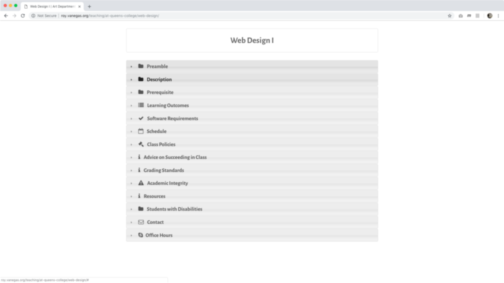

slidenumbers: true
autoscale: true
build-lists: true
theme: work, 1
footer: Using GitHub to Teach Web Design/Development

[.hide-footer]

# Using GitHub to Teach Web Design/Development

Roy Vanegas
Art Department
Queens College

## Teaching & Learning Showcase
## 2 November 2018

^
* Be already logged in to GitHub’s web site
* Check projector resolution
* 1080p, 1080i, and 720p: 16:9
* Aspect ratio is set under Presentation menu
* Fill water bottle

---

[.footer: Slides]

# Slides

These slides are available at [http://bit.ly/2CWNNaF](http://bit.ly/2CWNNaF)

---

[.footer: Introduction]

# Hi!
* I’m Roy
* I teach web design and development

---

[.footer: Agenda]

# Agenda
1. Who is the target audience?
2. What is GitHub?
3. GitHub’s pros and cons.
4. How I use it in the classroom.
5. How I use it for assignments.
6. Q & A.

---

[.footer: Target Audience? (1 of 5)]

# Who’s The Target Audience?
* Design educators using tools such as Photoshop, Illustrator, InVision, Sketch, etc.
* Computer scientists teaching engineering concepts using computer programs.
* *Any* educator sharing computer files with their students.

---

[.footer: What is GitHub? (2 of 5)]

# What is GitHub?
* It allows users to keep track of changes made to a project — whether it’s a programming project, a design project, or both.
* It promotes the concept of divide-and-conquer through “branching,” a technique that allows learners to work on sections of a project independently.
* It encourages sharing in an open source manner, which is especially helpful in the classroom.
* It is much more than I can explain in 20 minutes.

---

[.footer: What is GitHub? (2 of 5)]

# What is GitHub?
* GitHub is comprised of a web site *and* a local application.
    1. Web site: [https://github.com](https://github.com)
    2. Desktop application: [https://desktop.github.com/](https://desktop.github.com/)
* Public projects are *free*; private projects require a fee.
* Students and educators are eligible for *free* private projects at [https://education.github.com/](https://education.github.com/).

---

[.footer: What is GitHub? (2 of 5)]

